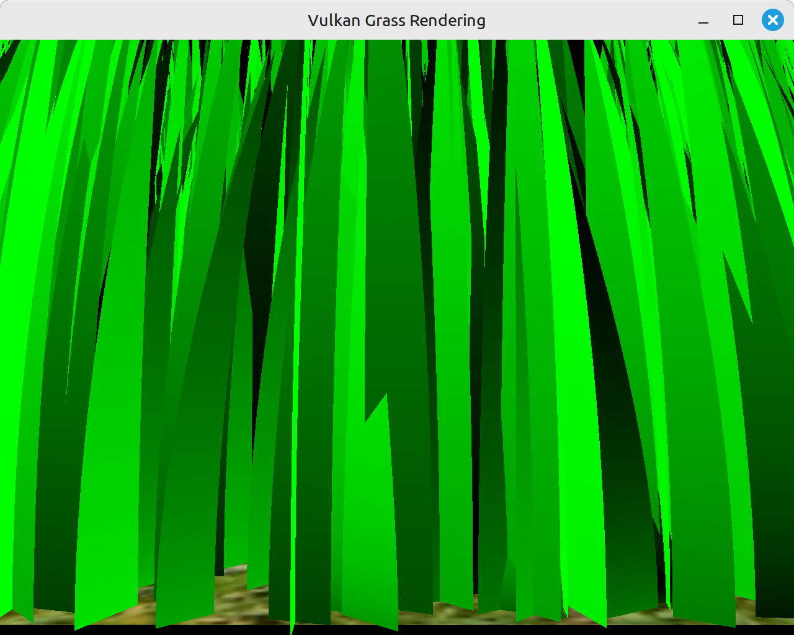

Vulkan Grass Rendering
==================================

**University of Pennsylvania, CIS 565: GPU Programming and Architecture, Project 5**

* Nicholas Liu
  * [Linkedin](https://www.linkedin.com/in/liunicholas6/)
* Tested on: Linux Mint 22 Wilma, AMD Ryzen 7 5800X @ 2.512GHz, 32GB RAM, GeForce GTX 1660 Ti

|  |
|:--:|
| *I output the normals as colors for debug and it looked kinda good* |

## Project Overview

This Vulkan project implements grass rendering techniques outlined in the paper [Responsive Real-Time Grass Rendering for General 3D Scenes](https://www.cg.tuwien.ac.at/research/publications/2017/JAHRMANN-2017-RRTG/JAHRMANN-2017-RRTG-draft.pdf)

Each blade of grass is represented as a cubic bezier: one at the base of the grass blade, that lies at some point above the grass blade, and one at the tip of the grass blade. The grass moves according to forces applied to the tip of the grass, namely gravity, a restorative force that tries to pull the grass to a vertical position, and a wind function. The grass control points are controlled using a compute shader.

The control points of each grass blade are transformed into quads with the tesselation pipeline. These quads are then distorted into a triangle shape that are bent along the bezier, thus producing the grass shape!

## Culling Methods

For maximum performance, several different criteria for culling blades were implemented

- Orientation culling: if a blade of grass is tangent to the camera's view vector, it has zero width and should not actually fill in any pixels, and can thus be discarded. Shown is an agressive cull that culls at `theta` where `cos(theta) < 10`

- Frustum culling: Any blades that are not within the view frustum should not be rendered and are culled at the compute stage. Shown is culling with a frustum that is just slightly too tight, hence blades of grass disappearing at the sides.

- Distance culling: In order to reduce the number of blades rendered, we don't render blades that are beyond a further distance. In order to lessen the effect of the aribtrary cutoff, we have each blade probabilistically have a higher change to disappear as they approach the maximum cutoff distance.

|  |  |  |
|:--:|:--:|:--:|
| *Orientation Culling* | *View Frustum Culling* | *Distance Culling* |

## Performance

I tested performance in 3 different camera positions: the default (looking at all the grass, at ground level), a far away scene, and a close up in the middle of the scene. For each of these I let the program run for 2^16 frames and timed how long it took to render them.

|  |  |  |
|:--:|:--:|:--:|
| *Default* | *Close* | *Far* |

In general, turning on all method of culling performed best, as expected. Distance culling made the greatest impact when the camera was far, and orientation culling had a significant impact where the camera was more or less parallel to the ground plane (as said scenarios are where the most blades of grass get culled, respectively).

Somewhat surprisingly, however, frustum culling seemed to have very little impact on performance generally -- its effect is explainable within the bounds of random variance; in fact the frustum-culling only run performed worse than no optimizations in the far camera setup. This is surprising, as I would expect frustum culling to have a very significant impact in the close up scene, where it should cull about 3/4 of the geometry. I hypothesize that the lack of performance benefit comes from the fact that the driver already performs frustum culling at the vertex stage with a computation that is about as cheap as what I perform manually in the compute stage.

| Optimizations     | Default Scene | Close Scene | Far Scene |
|-------------------|---------------|-------------|-----------|
| No Optimizations  |       118.695 |     118.259 |   92.6448 |
| Orientation Cull  |       92.0582 |     91.6129 |   92.7531 |
| Frustum Cull      |       114.687 |     115.402 |   93.2135 |
| Distance Cull     |       115.637 |      114.76 |   35.1957 |
| All Optimizations |        87.186 |     88.1485 |   35.5031 |

